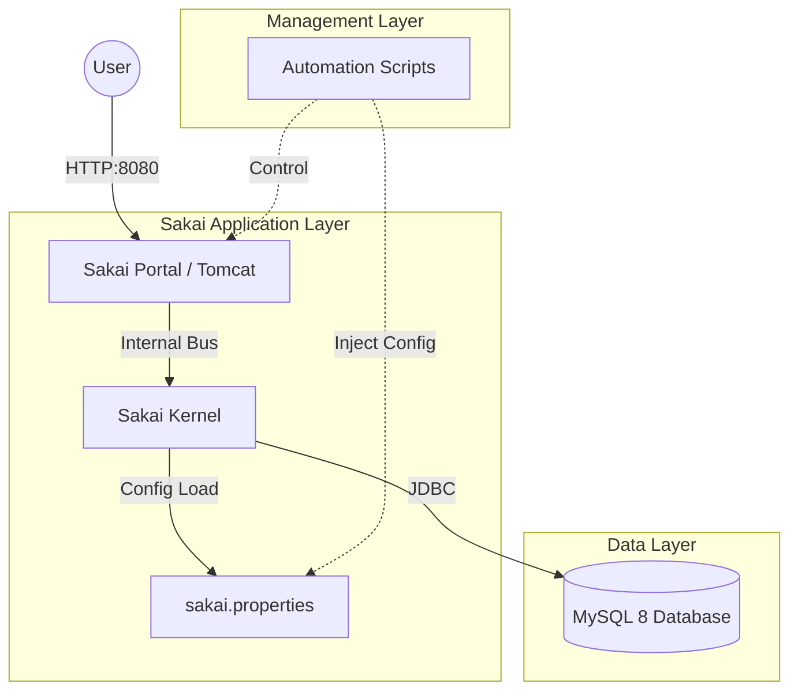

# Sakai LMS: Automated Deployment & Management

This project provides a robust, production-ready environment for **Sakai 23**, with automated scripts for both native (Ubuntu/Debian) and containerized (Docker) deployments. It features integrated fixes for common startup issues and a simplified management interface.

## 🏗️ Architecture

The deployment follows a standard N-tier architecture, enhanced with a dynamic configuration layer to ensure consistency across environments.



---

## 🚀 Quick Start (Docker)

The fastest way to get Sakai running is using the provided Docker automation script.

1.  **Clone the repository**.
2.  **Start the build**:
    ```bash
    ./manage_docker.sh build
    ```
3.  **Monitor the logs**:
    ```bash
    ./manage_docker.sh logs
    ```
4.  **Access the portal**: once the logs say "Server startup in [X] ms", go to [http://localhost:8080/portal](http://localhost:8080/portal).

---

## 🛠️ Script Documentation

The project includes several helper scripts to automate the lifecycle of the application.

| Script | Purpose | Environment |
| :--- | :--- | :--- |
| `manage_docker.sh` | **Recommended**. Unified tool for build, start, stop, and cleanup of containers. | Docker |
| `install_sakai.sh` | Performs a full native installation (Java 11, Tomcat 9, Maven, MySQL). | Native (Ubuntu) |
| `start_sakai.sh` | Starts the native Sakai service and monitors logs until it's ready. | Native |
| `stop_sakai.sh` | Safely shuts down the native Sakai service. | Native |

### Detailed Command Reference (`manage_docker.sh`)

- `build`: Builds the Docker image from source and starts services.
- `start / stop`: Manage existing containers without rebuilding.
- `status`: Shows the health and uptime of the app and database.
- `clean`: Removes all containers and **deletes all volumes** (Use with caution!).

---

## 🔧 Configuration

All deployment methods use a template-based configuration system. You can customize the following variables in `docker-compose.yml` or the script headers:

| Variable | Default | Description |
| :--- | :--- | :--- |
| `SAKAI_DB_USER` | `sakaiuser` | Database ownership user. |
| `SAKAI_DB_PASS` | `sakaipassword` | Secure password for the database. |
| `SAKAI_DB_NAME` | `sakaidatabase` | Internal database name. |
| `SAKAI_DB_HOST` | `db` (Docker) / `127.0.0.1` (Native) | Connection endpoint. |

---

## 🔍 Troubleshooting: The "404 Not Found" Fix

If you encounter a 404 error on the `/portal` page, it is typically caused by a failed database connection during kernel initialization. **This project includes built-in fixes for the two most common causes:**

1.  **Missing Schema**: We set `auto.ddl=true` to automatically build the 340+ required tables on first run.
2.  **MySQL 8 Public Key Error**: We include `&allowPublicKeyRetrieval=true` in all connection strings to allow the Java driver to authenticate securely with MySQL 8.

### Manual Verification
If the portal doesn't load after 10 minutes:
1.  Run `./manage_docker.sh logs` (Docker) or `tail -f /opt/tomcat/logs/catalina.out` (Native).
2.  Search for `SEVERE` or `BeanCreationException`.
3.  Ensure the `db` service is "Healthy" (Docker) or your local MySQL service is running.

---

## 📄 License
Sakai is licensed under the **Educational Community License, Version 2.0**. This project provides deployment tooling for the open-source Sakai LMS.
