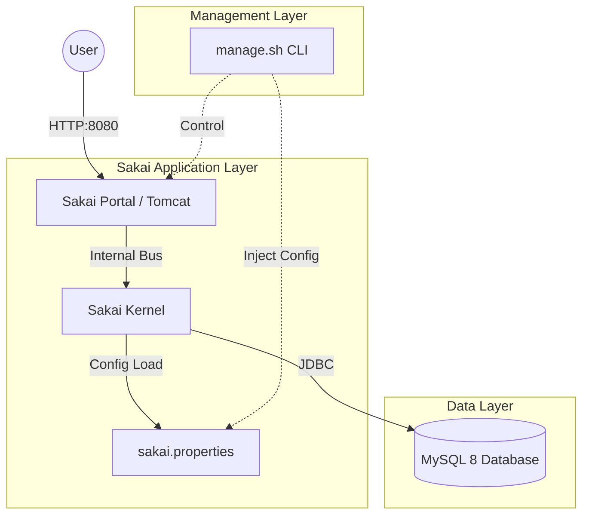

# Sakai LMS: Automated Deployment & Management

This project provides a robust, production-ready environment for **Sakai 23**, with automated scripts for both native (Ubuntu/Debian) and containerized (Docker) deployments. It features integrated fixes for common startup issues and a simplified management interface.

## 🏗️ Architecture


```mermaid
graph TD
    User((User)) -->|HTTP:8080| Portal[Sakai Portal / Tomcat]
    subgraph "Sakai Application Layer"
        Portal -->|Internal Bus| Kernel[Sakai Kernel]
        Kernel -->|Config Load| Properties[sakai.properties]
    end
    subgraph "Data Layer"
        Kernel -->|JDBC| MySQL[(MySQL 8 Database)]
    end
    subgraph "Management Layer"
        Scripts[manage.sh CLI] -.->|Control| Portal
        Scripts -.->|Inject Config| Properties
    end
```

---

## 📁 Project Structure

```
sakai-project/
├── manage.sh                ← Unified CLI (run ./manage.sh for all commands)
├── Dockerfile               ← Multi-stage build (Maven → Tomcat)
├── docker-compose.yml       ← MySQL + Sakai services
│
├── config/                  ← All configuration
│   ├── sakai.properties         Production Sakai config (mounted into container)
│   ├── sakai.properties.template  Template with env vars (used by Dockerfile)
│   ├── tomcat-server.xml        Custom Tomcat server.xml (mounted into container)
│   └── entrypoint.sh            Docker container entrypoint
│
├── scripts/                 ← Bare-metal (non-Docker) scripts
│   ├── install_sakai.sh         Full native Ubuntu installer
│   ├── start_sakai.sh           Start Sakai via systemd
│   └── stop_sakai.sh            Stop Sakai via systemd
│
├── nginx/                   ← Nginx reverse proxy configs
│   ├── sites-available/         Config files per domain
│   └── sites-enabled/           Symlinks to active configs
│
├── ssl/                     ← SSL certificates (gitignored)
├── docs/                    ← Notes and troubleshooting guides
└── backups/                 ← Database dumps (created by manage.sh backup)
```

---

## 🚀 Quick Start (Docker)

1.  **Clone the repository.**
2.  **Start the build:**
    ```bash
    ./manage.sh build
    ```
    > [!TIP]
    > On fresh Ubuntu systems, the script will automatically detect if Docker is missing and install it for you!

3.  **Monitor the logs:**
    ```bash
    ./manage.sh logs
    ```
4.  **Access the portal**: once the logs say "Server startup in [X] ms", go to [http://localhost:8080/portal](http://localhost:8080/portal).

---

## 🛠️ Command Reference (`manage.sh`)

Run `./manage.sh` with no arguments to see the full help menu.

### Docker Lifecycle

| Command | Description |
| :--- | :--- |
| `./manage.sh build` | Build the Docker image from source and start services |
| `./manage.sh start` | Start existing containers |
| `./manage.sh stop` | Stop running containers |
| `./manage.sh restart` | Restart all services |
| `./manage.sh logs` | Follow Sakai application logs |
| `./manage.sh status` | Show container health and uptime |
| `./manage.sh clean` | Remove containers **and volumes** ⚠️ |

### Quick Access (Shortcuts)

| Command | Description |
| :--- | :--- |
| `./manage.sh shell` | Open a bash shell inside the Sakai container |
| `./manage.sh db` | Open a MySQL shell inside the database container |
| `./manage.sh props` | Edit `sakai.properties` in your default editor |

### Data Management

| Command | Description |
| :--- | :--- |
| `./manage.sh backup` | Dump the MySQL database to `backups/` |
| `./manage.sh restore <file>` | Restore a previously saved backup |

### Bare-Metal Installation

| Command | Description |
| :--- | :--- |
| `./manage.sh install` | Run the full native Ubuntu installer (Java, Tomcat, Maven, MySQL) |

> [!IMPORTANT]
> The `install` command is for bare-metal Ubuntu servers only — do not use it inside Docker.

---

## 🔧 Configuration

All configuration lives in the `config/` directory. Key variables can be customized in `docker-compose.yml` or `config/sakai.properties`:

| Variable | Default | Description |
| :--- | :--- | :--- |
| `SAKAI_DB_USER` | `sakaiuser` | Database ownership user |
| `SAKAI_DB_PASS` | `sakaipassword` | Database password |
| `SAKAI_DB_NAME` | `sakaidatabase` | Internal database name |
| `SAKAI_DB_HOST` | `db` (Docker) / `127.0.0.1` (Native) | Connection endpoint |

---

## 🔍 Troubleshooting: The "404 Not Found" Fix

If you encounter a 404 error on `/portal`, it is typically caused by a failed database connection. **This project includes built-in fixes:**

1.  **Missing Schema**: `auto.ddl=true` automatically builds the 340+ required tables on first run.
2.  **MySQL 8 Public Key Error**: `&allowPublicKeyRetrieval=true` is included in all connection strings.

### Manual Verification
If the portal doesn't load after 10 minutes:
1.  Run `./manage.sh logs` and search for `SEVERE` or `BeanCreationException`.
2.  Run `./manage.sh status` to confirm containers are healthy.
3.  Run `./manage.sh db` to test the database connection directly.

See `docs/404-fix.md` for more detail on root causes and manual fixes.

---

## 📄 License
Sakai is licensed under the **Educational Community License, Version 2.0**. This project provides deployment tooling for the open-source Sakai LMS.
